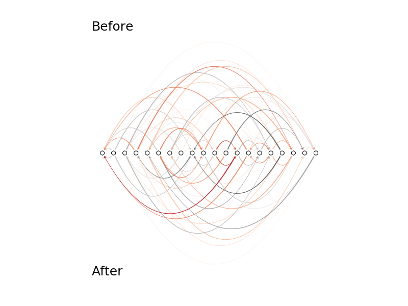

# Network Line Graph

Visualise a network by assigning nodes a position along the
x-axis and then drawing the edges between them as Bezier curves.

Such a visualisation is particularly useful to compare two different
network states, as a second network state can be drawn in the same way
below the x-axis. The symmetry around the x-axis accentuates changes
in the network structure.



## Example:

``` python
import numpy as np
import matplotlib.pyplot as plt
import network_line_graph as nlg

# initialise figure
fig, ax = plt.subplots(1,1)

# make a weighted random graph
n = 20 # number of nodes
p = 0.1 # connection probability
a1 = np.random.rand(n,n) < p # adjacency matrix
w1 = np.random.randn(n,n) # weight matrix
w1[~a1] = np.nan

# plot connections above x-axis
nlg.draw(w1, arc_above=True, ax=ax)

# make another weighted random graph;
a2 = np.random.rand(n,n) < p # adjacency matrix
w2 = np.random.randn(n,n) # weight matrix
w2[~a2] = np.nan

# plot connections below x-axis
nlg.draw(w2, arc_above=False, ax=ax)

# annotate
ax.text(0,1, 'Graph 1', transform=ax.transAxes, fontsize=18)
ax.text(0,0, 'Graph 2', transform=ax.transAxes, fontsize=18)
plt.show()
```
